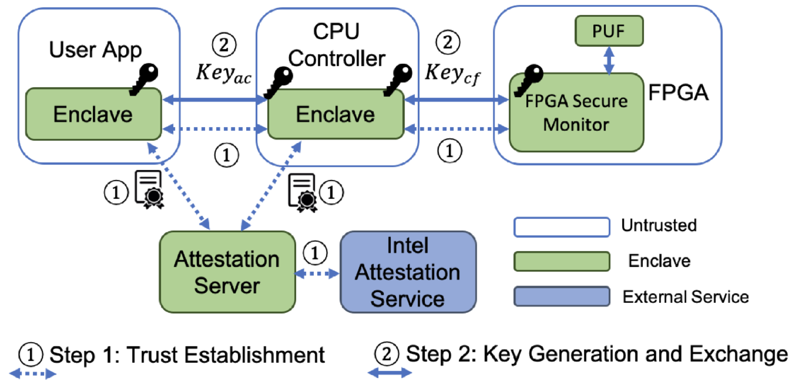

# SGX-FPGA Trusted Execution Environment for CPU-FPGA Heterogeneous Architecture

# 概述
现有的基于CPU的TEE并不支持FPGA。因此本文提出了SGX-FPGA。顾名思义，是将SGX的enclave应用于CPU-FPGA架构中的FPGA中来实现FPGA TEE。

# 背景
异构的CPU-FPGA架构成功将FPGA的高计算能力融入到传统的CPU架构中，Xilinx ZYNQ SoC就是一个例子。

但是这种架构没有一个安全的执行环境。尽管单独针对FPGA或CPU都有相对成熟的TEE机制，但是却甚少关注两者之间的交互安全，攻击者可以从CPU端攻击FPGA端的数据的机密性和完整性，反之亦然。

由于CPU-FPGA的异构结构，直接将适用于CPU的TEE移植到该架构上不合适。并且FPGA是独立于CPU的特殊硬件加速器，具有潜在的恶意IP核，可以对CPU-FPGA系统产生自发的攻击。

# 本文工作

开发了支持FPGA的TEE，使得基于CPU的SGX原语能够支持异构FPGA组件。

本文的工作还使得CPU和FPGA之间构建了安全的硬件隔离路径，以保护存储在两个组件和传输中的敏感数据。

具体来说，本文设计了一种安全协议，用于对通信双方进行身份验证，并且对CPU和FPGA之间传输中的数据进行保护。利用FPGA上的物理不可克隆功能（PUF）构建硬件信任根。

## 所能提供的安全防护
+ SGX可以保护CPU端的隐私数据和程序不被破坏
+ 隐私数据被加密后在CPU和FPGA之间进行传递，且密钥只掌握在CPU控制器和FPGA安全监视器中，且FPGA内核只能通过FPGA安全监视器进行访问，因此这消除了CPU端的用户应用程序攻击FPGA内核的可能性
+ 用户应用程序只在enclave中存放敏感数据，并且在将其导出之前对其进行加密，因此恶意的IP无法访问敏感数据

## 威胁模型
在定义模型时遵循的原则：
+ 本文的目标是针对CPU TEE一致的威胁模型。
+ 只假设CPU硬件和enclave是可信的
+ 认为FPGA和PCIe总线是不可信的
+ 不打算让SGX-FPGA超过预期的安全保障和设计目标，因此不考虑测信道攻击和硬件物理攻击
+ 将CPU-FPGA系统中的威胁分为4类：
  + CPU到CPU攻击：攻击者可以从CPU端入手对隐私数据和程序造成破坏
  + CPU到FPGA攻击：CPU端的攻击者可以篡改CPU和FPGA均可访问的FPGA全局内存中的数据，未经授权调用FPGA内核触发故障注入攻击，或者探测PCIe总线上的数据
  + FPGA到CPU攻击：攻击者可以向FPGA中注入恶意IP并触发，然后访问或者篡改CPU侧或者是PCIe总线上的软件数据
  + FPGA到FPGA攻击：攻击者可以在FPGA内部针对FPGA发起硬件物理攻击，但本文并没有对此威胁作出贡献

# 架构细节
SGX-FPGA架构图如下所示：

可以看到SGX-FPGA主要由四个部分组成：
+ enclave中的用户应用程序是CPU端与FPGA通信的软件实体
+ CPU控制器（CPU Controller）是运行在CPU enclave中的软件代理，负责连接事件，并对进出FPGA的数据传输流进行加密/解密
+ FPGA安全监视器（FPGA Secure Monitor）：是对应的FPGA代理，与CPU控制器一起工作，以确保CPU和FPGA之间的数据传输安全
+ PUF和FPGA安全监视器进行连接，提供FPGA标识并生成数据加密密钥

整个流程为：`用户级应用程序和CPU控制器`能够在各自的区域内处理敏感数据和明文数据，`FPGA安全监控器`接收来自CPU的加密数据，并通过`管道`将其解密并且传输到`FPGA内核`。这样，通过PCIe总线和全局内存传输的数据始终是加密的。

因此，即使主机操作系统或者PCIe总线受到威胁，也没有对手可以访问明文数据。

具体来说：当用户应用程序与FPGA通信时，数据会通过不受信任的驱动系统、操作系统、hypervisor和PCIe总线。要安全地通过上述路线，用户应用程序需要创建隔离路径，而要构建隔离路径，用户程序首先需要向CPU控制器证明它是合法enclave中的受信任实体，过程如下：
+ 用户应用使用ECDH算法和CPU控制器协商出一个加密密钥，并且加密数据以防不可信访问
+ CPU控制器通过向PUF发送预选的challenges并且通过预登记的challenge-response pair（CRP）数据库来验证FPGA身份
+ 验证完成后，CPU控制器启动与PUF的另一轮通信，PUF生成第二个加密密钥，在CPU控制器和FPGA安全监控器之间共享，以确保CPU和FPGA之间的双向数据通信安全。

# 运行流程
## CPU-FPGA隔离路径建立过程

建立隔离路径的过程如下图所示：

SGX-FPGA需要完成两个事情：
+ 通过本地或远程认证建立CPU与FPGA之间的信任关系
  + 用户应用程序和CPU控制器都有enclave，他们可以通过SGX原有的验证机制进行相互验证。
  + CPU控制器采用基于PUF的CRP认证协议来验证FPGA设备的真实性，在此之前，CPU控制器需要维护一个预登记的CRPs数据库，作为验证PUF和FPGA组件的基础
    + 具体做法为：CPU控制器从数据库中随机选取一个challenge发送给PUF，PUF将响应通过FPGA安全监视器原路返回给CPU控制器，CPU控制器通过将数据库中的pair和响应做比对来确定FPGA是否可以信任
    + 在进行远程安全认证时，用户应用和CPU控制器都需要向远程可信服务器证明自己，从而获取认证服务器颁发的证书，双方再交换证书来获取信任，之后的步骤同上
+ 生成CPU与FPGA之间的安全通信所需的两个加密密钥：保护用户程序和CPU控制器之间通信的密钥和保护CPU控制器和FPGA之间通信安全的密钥，本文不考虑FPGA内部通信的安全

通过上述两个步骤即可将CPU enclave的安全属性扩展到FPGA，从而可以创建FPGA enclave

## CPU和FPGA之间的安全通信
+ 所有敏感数据都存储在CPU端的enclave中
+ 用户应用需要对数据使用之前协商的密钥进行加密，将密文发送给CPU控制器，后者进行解密
+ CPU控制器需要将数据使用和FPGA协商的密钥（由PUF生成）进行加密，将数据以秘文的形式发送
+ FPGA安全监视器对数据进行解密，并将其传输到FPGA内核
+ 完成计算后将数据原路加密返回

### CPU和FPGA之间密钥的生成
PUF RTL为密钥生成器