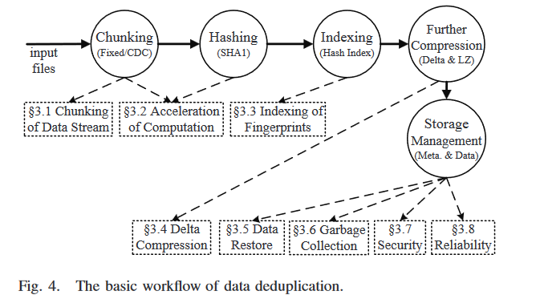
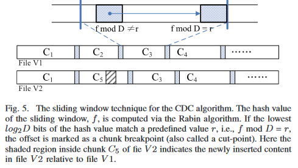
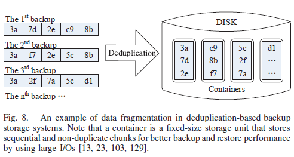

#### 0. Overview

​	重复数据删除是一种节省空间的数据存储技术(有关重复数据删除的完整概述，请参阅[40])。它将文件数据划分为固定大小或可变大小的块，并通过对应内容的加密散列(称为指纹)来标识每个块。假设指纹与不同块的碰撞概率几乎可以忽略不计[10]。重复数据删除只存储重复数据块的一个物理副本，并通过小引用将具有相同指纹的重复数据块引用到物理副本。

​	加密重复数据删除在普通重复数据删除(即不加加密的重复数据删除)的基础上增加了一个加密层，在重复数据删除之前对数据块进行操作，并在重复数据删除存储中提供数据机密性保障。它实现了基于消息锁定加密(MLE)[7]、[8]的加密层，该加密层使用从块内容派生的对称密钥(称为MLE密钥)对每个块进行加密;例如，MLE密钥可以计算为收敛加密[14]中块内容的加密哈希值。这确保了从重复块派生的加密块仍然具有相同的内容，因此与重复数据删除兼容。

​	历史MLE[8]构建在一些公开可用的函数(例如，加密哈希函数[14])上，以生成MLE密钥。它为不可预测的块提供安全保护，这意味着这些块是从一个足够大的消息集中提取的，因此无法轻松预测块的内容;否则，如果块是可预测的，并且已知是从有限集中提取的，历史MLE很容易受到离线暴力攻击[8]的攻击。具体来说，给定一个目标加密块，对手从有限消息集中对每个可能的块进行采样，获得相应的MLE密钥(例如，通过对每个采样块[14]应用加密哈希函数)，并使用这样的密钥对每个采样块进行加密。如果加密结果等于目标加密块，则攻击者可以推断采样块是目标加密块的原始输入。

​	为了防止离线暴力破解攻击，DupLESS[7]实现了服务器辅助MLE，它引入了一个全局秘密，保护密钥生成过程不受公共访问。服务器辅助MLE利用专用的密钥管理器来维护不受对手攻击的全局秘密。它根据块的全局秘密和加密散列(也就是指纹)派生每个块的MLE密钥，这样对手就无法在不知道全局秘密的情况下派生任何采样块的MLE密钥。因此，如果全局秘密是安全的，服务器辅助MLE对离线暴力破解攻击是健壮的，并实现了可预测和不可预测块的安全性;否则，如果全局秘密被泄露，它将为不可预测的块保留与历史MLE[8]中相同的安全保证。DupLESS[7]进一步实现了两种机制来加强安全性:(i)不经意伪随机函数(OPRF)协议，该协议允许客户端以盲的方式提交每个块的指纹(给密钥管理器)，这样密钥管理器可以在不学习实际指纹的情况下成功生成MLE密钥;(ii)速率限制机制，主动控制密钥管理器的密钥生成速率，防止受到攻击的客户端试图发出过多的密钥生成请求而进行在线暴力破解攻击。

#### 1. Process

- Chunking of data stream：如何设计一种有效的分块算法以最大程度地检测数据流中的冗余以进行重复数据删除是一个重要的研究和实际问题
- Acceleration of computation tasks：重复数据删除系统中的分块和指纹识别消耗了大量的计算资源。减少这种开销是一个新兴且具有挑战性的问题
- Indexing of fingerprints:  随着用户数据的规模不断从TB增长到PB甚至EB规模，代表用户数据的指纹总规模将很快压垮主存。这就产生了如何有效地存储和索引存储在磁盘上的用户数据块的这些指纹的问题，这是一个越来越重要和具有挑战性的研究和实际问题。
- Further compression: 如何消除重复数据删除系统中非重复但非常相似的块之间的冗余，即增量压缩，是另一个有趣且重要的研究问题。如图 4 所示，增量和传统压缩（例如 LZ 压缩）方法属于进一步压缩类别。 LZ 压缩直观且易于实现 [7、8、13]，而增量压缩是一种可选方法，因为它给重复数据删除系统带来了新的挑战。
- Data restore: 在基于重复数据删除的存储系统中，文件或数据流的块在重复数据删除后可能在物理上分散存储，这会显着降低恢复性能。
- GC: 在去重系统中，一些数据块将被许多文件共享，因此确定删除文件时哪些块可以回收是一个新的挑战。
- Security：不同用户数据之间的重复数据删除可能会导致潜在的安全风险，即一个用户的隐私和敏感信息泄露给另一个用户，反之亦然。
- Reliability：重复数据删除降低了存储系统的可靠性，因为一些关键数据块的丢失会导致许多引用文件/备份丢失。

#### 2. Key Technologies

##### 2.1 Chunking of Data Stream

**分块问题：**

- FixedSize Chunking：将数据切割成相同，存在边界问题，判断率并不强，可能一点细微的改动，会让两个完全相同的块一点不一样。
- Content-Defined Chunking：在文件内容上使用滑动窗口技术，并计算窗口的哈希值（例如，Rabin指纹[77]），如图5所示。如果该滑动的哈希值确定为块断点窗口满足一些预定义的条件。因此，对于在文件V 1 的块C2上被修改的文件V 2 进行分块，CDC算法仍然可以识别出内容未被修改的块C3和C4的正确边界。

##### 2.2 Acceleration of computational task

​	重复数据删除是一个计算密集型过程，包含两个耗时的计算任务，即内容定义的分块和基于安全哈希的指纹识别。前者通过 CDC 将数据流分成几个块，后者为每个块计算一个密码摘要（即指纹）以唯一地表示它以进行重复检测。因此，重复数据删除过程的分块和指纹识别阶段需要计算哈希值（例如 Rabin 和 SHA1），这可能会延长基于重复数据删除的存储系统 [95、96、99] 中的写入延迟，尤其是在高性能主节点中存储系统使用基于闪存的设备来增加内存处理能力[97]。但是，如上图所示，这个过程中是多个独立任务并行执行的。

​	具体有两个办法：

- 多线程的办法：THCAS[93]在其重复数据删除系统中提出了一种cpu绑定(即分块和指纹)、I/ o绑定(即写入)和网络通信任务的存储管道。P-Dedupe[76]类似于THCAS，但它进一步并行了分块和指纹的子任务，从而实现了更高的吞吐量。Guo等人[62]提出了一种事件驱动的多线程客户端-服务器交互模型，用于流水线化基于fsc的重复数据删除。Ma等人[94]为基于fsc的重复数据删除系统中的指纹、压缩和加密计算子任务提出了一种自适应流水线模型。
- GPGPU：基于GPGPU的方法。GPGPU设备已被证明在许多计算密集型应用中提供比CPU更强的计算能力，特别是在高性能存储系统中的哈希和密码计算应用中。StoreGPU[95, 101]和Shredder[96]充分利用GPGPU的计算能力来加速数据重复删除中流行的计算密集型原语(即分块和指纹)。类似地，GHOST[97]将分块、指纹和索引等重复数据删除任务卸载到GPGPU，以消除高性能主存储系统的计算瓶颈。

​	总之，基于多线程的解决方案可以通过流水线重复数据删除任务和并行分块和指纹在多核/多核处理器的计算机系统中轻松实现[93,100]。基于gpgpu的解决方案可以提供更高的吞吐量，但需要额外的硬件成本[95,96,101]。另一种不影响计算任务的速度，但允许备份系统扩展到其他客户机的方法是将分块工作卸载给客户机。

##### 2.3 Indexing of Fingerprints

​	在对数据流进行分块和指纹处理后，对数据块指纹进行索引，以帮助确定重复数据块和非重复数据块，这是重复数据删除过程的关键阶段。早期的重复数据删除系统将整个块指纹索引存储在内存中，以便快速识别副本[14]。

​	随着数据量的爆炸式增长，指纹的总数和索引的大小呈指数级增长，迅速超出重复数据删除系统的RAM容量。这可能导致频繁地访问低速磁盘进行指纹索引查找，从而严重限制重复数据删除系统的吞吐量。例如，为了备份一个1PB的唯一数据集，假设平均块大小为8KB，将生成大约2.5TB的SHA-1指纹(每个块160bit)。2.5TB的指纹加上每个块(例如，8字节)的额外位置和索引消息，将太大，无法完全存储在典型的重复数据删除系统的主存中。由于随机访问磁盘上的索引要比访问RAM慢得多，频繁访问磁盘上的指纹将导致系统吞吐量变得不可接受的低。例如，一些重复数据删除系统[11,13,58]报告说，对磁盘指纹索引的访问吞吐量约为1- 6mb /秒，这在这些系统中成为严重的性能瓶颈。因此，针对大规模重复数据删除系统，需要一种高效的指纹索引方案。

​	根据所使用的具体方法，指纹索引方案可以导致精确重复数据删除或近似重复数据删除[102,103]。前者意味着消除所有重复块，而后者则以略微降低的重复检测精度(即，没有检测到少量重复块)换取更高的索引查找性能和更低的内存占用。目前，有四种加速重复数据删除索引查找过程和缓解磁盘瓶颈的方法，即基于位置的重复数据删除方法、基于相似度的重复数据删除方法、闪光辅助重复数据删除方法和集群重复数据删除方法。表V列出了这四种用于数据重复删除系统的指纹索引的最新方法，下面将对此进行详细说明。

- Locality-based approaches: 基于局部性的指纹索引方案，大概就是将同一块数据的不同chunk的指纹连续存储。
- Similarity-based approaches: 相似性的方法。重复数据删除上下文中的相似性是指一个文件或数据流与以前的、类似的文件或数据流的相似性特征。一种常见的相似性检测技术是用chunk指纹集[60]的最大值或最小值表示一个文件。因此，所选的指纹可用于构建主索引，并将用于重复数据删除索引的RAM开销最小化，特别是对于具有很少或没有局部性的数据集。极限装箱[60]是一种基于相似性的方法，它通过利用文件相似性来实现对每个文件进行块查找的单个磁盘索引访问，从而提高重复数据删除的可伸缩性。
- Flash-assisted approaches: Flash-assisted方法。由于磁盘上指纹的查找吞吐量受到昂贵的磁盘寻道操作(仅约100 IOPS)的限制，因此有人提出随机访问闪存作为磁盘的替代方案，为指纹索引提供高吞吐量I/ o(约10万IOPS)[116]。闪存指纹的内存高效和高性能的主索引设计，称为键值存储[109,116,117]，被进一步用于这些闪存辅助的重复数据删除索引方法。
- Cluster Reduplication: 上述大多数方法都是在单个节点上消除重复数据删除，这限制了重复数据删除的吞吐量和可伸缩性。这种限制导致了由多个节点组成的集群重复数据删除系统的发展[59,111,112]。集群重复数据删除的基本思想是通过一种数据路由方案，将来自备份客户端的数据流分配给多个重复数据删除节点，该方案支持节点间负载均衡，并支持单个节点独立的节点内重复消除[112]。

总结： 通常，基于位置的方法被广泛用于提高重复数据删除索引性能，无论指纹存储在硬盘驱动器[13]或闪存驱动器上[61]。基于相似性的方法被证明可以有效地减少重复数据删除索引的RAM开销[60,102,103]。闪存辅助方法为重复数据删除系统带来额外的硬件成本，但它们的键值存储方案也可用于索引磁盘指纹[108,109]。集群重复数据删除方法适用于大量存储系统，但可能会降低重复数据删除比[111,112,114]，或需要更多系统资源来维持高的重复数据删除比[59,113]。

##### 2.4 Post-De-duplication Compression 

​	为了节省存储系统的空间，重复数据删除技术在存储系统中得到了广泛的应用。实际上，基于指纹的重复数据删除方法无法识别冗余的很大一部分。每个区块通常都有内部冗余，可以用传统压缩机(如LZ)去除。如果一起添加到系统中的唯一块被压缩在一个更大的“压缩区域”中，那么整体压缩率将高于单独压缩每个块。例如，DDFS报告典型的2×压缩[7]。

​	除了重复数据删除后块的简单可压缩性之外，只包含少量不同字节的相似块之间可能存在高度重叠，例如图5中的块C2和C5。即使只有几个不同的字节，这些块基于安全哈希的指纹也会完全不同[8,11,68]。如第III-A节所述，重新分块的方法被提出，通过将非重复的块进一步划分为更小的块来提高重复数据删除的比例[75,84 - 86]，这有助于识别更多的冗余。相比之下，重复数据删除后增量压缩消除了非重复但相似的块之间的冗余，而不需要重新分块操作来实现更高的冗余消除比[8,54,55,68]。因此，它被认为是一个有效的重复数据删除后处理过程，可以进一步消除数据冗余，但增加额外的计算、索引和I/O开销，因此是一个可选的重复数据删除后存储管理阶段(参见图4)。

##### 2.5 Data Restore

​	在识别重复数据并存储非重复数据后，需要高效地恢复数据，有效地管理碎片化的存储空间(在用户进行删除操作后)。后一个过程称为垃圾收集。因此，数据恢复和垃圾回收已经成为重复数据删除系统存储管理阶段的两个重要问题。本小节主要回顾最新的数据恢复方案，下一小节将详细讨论垃圾收集问题。

​	图8显示了基于重复数据删除的备份存储系统中的数据碎片示例。每个备份(例如，第3个备份)中逻辑上连续的块在重复数据删除后物理上分散在几个数据容器(固定大小的存储单元)中，也称为块碎片[23,128,129]，而不是按传统方式以紧凑的连续序列排列。由于hdd的随机I/O性能较差，块碎片(如磁盘碎片)会显著降低恢复性能。此外，块碎片还会损害垃圾收集的性能[62,129]。例如，如果用户删除图8中的第一个备份，那么将很难回收第一个备份中的数据块的存储空间，因为其中一些数据块被第二个和第三个备份引用了。

​	一些重复数据删除后的数据恢复方案重写重复的、但碎片化的数据块，以减轻读(恢复)性能的下降，从而权衡重复数据删除比(节省的容量)和读(恢复)性能。表VII综合研究了在重复数据删除系统中提高恢复性能的技术现状，并根据重复数据删除部署的存储环境将其分为三大类，即主存储、备份存储和云存储

​	主存储系统是I/ o时延敏感的[6,64]，这使得重复数据删除引起的、读时延延长的碎片问题极为重要。iDedup[64]利用主存储工作负载的空间局部性，选择性地对顺序重复的磁盘块进行重复数据删除，以减少碎片，并摊平随机I/O造成的读延迟。面向性能的重复数据删除(POD)[130]通过在关键I/O路径中识别容量不敏感但性能敏感的小重复写和文件，进一步提高了基于重复数据删除的主存储系统的读性能。

#### 3. Resources and Perspectives

在本节中，我们将首先了解重复数据删除的典型应用场景，以及这些应用场景如何结合重复数据删除并从中受益。然后，我们就重复数据删除如何在商业存储系统中工作提供行业见解。我们还介绍了用于重复数据删除研究的公共可用资源，包括开源项目、数据集、跟踪等。最后，我们通过确定研究界面临的开放问题和研究挑战来结束本节，这些问题是数据重复删除的可能未来方向。

##### 3.1 Application Scenarios of Data Deduplication

- Secondary storage:  在二级存储系统中有大量的副本，例如备份和归档存储[7,11,13,58,59,187]。基于这一观察，现在是EMC的一部分的存储公司Data Domain[13]认为“基于磁盘的重复数据删除存储已经成为取代磁带库的新一代企业数据保护存储系统。”事实上，在此类系统中使用重复数据删除已被证明可以实现约5 ~ 40的数据减少系数[7,8]，从而显著节省存储空间和相应的硬件成本。最近，重复数据删除后增量压缩被用于压缩不重复但相似的数据块，作为重复数据删除的一种补充方法。这种重复数据删除后方案在重复数据删除的基础上实现了2 ~ 5的额外数据减少因子，但增加了额外的计算和I/O开销[54,55,68]。
- Primary storage: 最近的研究表明，重复数据删除可以在主存储[5]上实现高达40 ~ 60%的数据减少因子，特别是对于服务器文件系统[5,6,179](参见表II)。主存储重复数据删除不仅减少了存储空间需求，还消除了关键I/O路径上的重复I/O[64,130,179]，有助于提高主存储的磁盘I/O性能。最近，一些用于主存储的开源文件系统，如ZFS[73]、OpenDedupe[188]和Lessfs[189]，都加入了重复数据删除以获得更好的存储性能。**由于重复数据删除在写路径会导致计算和索引延迟，在读路径会导致磁盘碎片，因此ZFS和Lessfs将重复数据删除作为可选功能提供给用户。**请注意，与从存储重复数据删除相比，主存储重复数据删除有很大不同，主要原因有三个:**I/O延迟对重复数据删除操作更加敏感**，**读和删除操作发生得更频繁**，**主存储系统中存在的副本更少**。
- Cloud storage：云存储近年来已成为计算机系统的一种重要存储平台[74,180]。由于底层广域网有限的网络带宽是云存储的主要性能瓶颈，重复数据删除可以通过识别未修改的数据来加快客户端与云之间的数据同步。同时，重复数据删除也有助于降低云端的存储开销。目前，DropBox、SkyDrive(现在称为OneDrive)、谷歌Drive等都采用了重复数据删除技术，以提供更好的云存储服务[74,190]。正如微软的研究[5]中所讨论的那样，虽然用户之间存在大量的重复数据，但跨用户数据重复删除会导致安全问题。

##### 3.2 Industry Perspective of Deduplication

### 思考

那么对于云存储服务提供商而言，如果一个请求（假设是写请求）到来，那么服务器首先需要对到来的数据请求进行检索，如果该数据已经存在，那么就只进行相关的计算处理，而不再重复存储。那么潜在的问题是：

- 这种请求多不多，如果并不多，那么单独加速这个步骤显然是多余的。
- 需要考虑分块、求指纹、检索这三个步骤的时间开销，如果第三步占据的时间开销并不长，那么这东西也是多余的。（当然，这需要考虑前两个步骤能不能用SmartSSD来做，如果可以的话，就比较完美）。